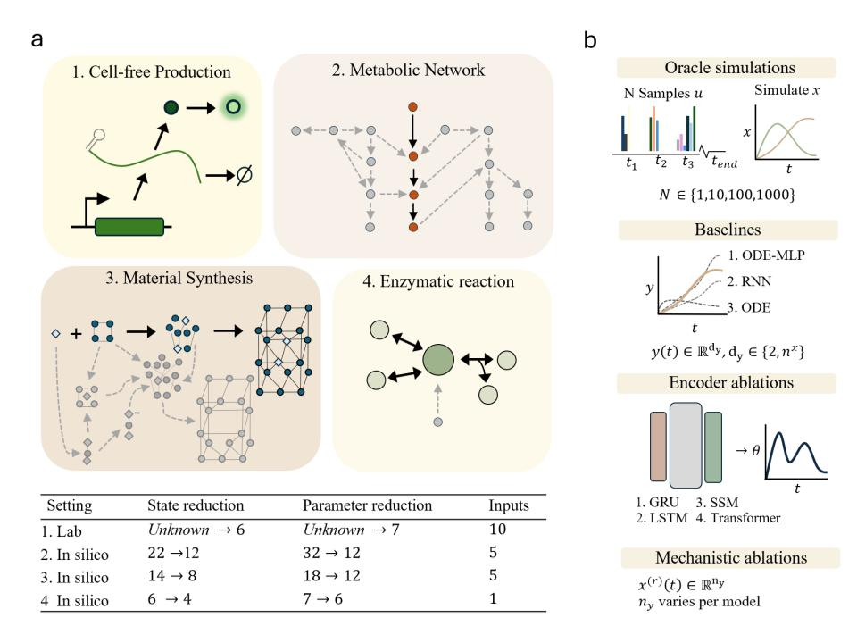

# Bolus-to-parameter maps

This repository is the official implementation of [Bolus-to-parameter maps](https://arxiv.org/abs/0000.00000).

## Overview



**Overview:** Our framework evaluates bolus-to-parameter mapping across four distinct dynamical systems: cell-free production, metabolic networks, material synthesis, and enzymatic reactions. We test how various sequence encoders (GRU, Transformer, SSM) map discrete input events to mechanistic ODE parameters ($\theta$). The evaluation systematically explores the effects of state and parameter reduction on model identifiability, benchmarking our approach against standard neural and ODE baselines.

All runnable scripts are located in the `last-layer-ode` directory. **Please run everything from the repository root.**

## Requirements

To install the necessary requirements:

```bash
pip install -r requirements.txt
```

## Data Generation

Before training, you must generate the synthetic datasets using the provided ODE simulators. Datasets are saved as `.npz` files.

Below are the basic commands to generate the primary 1000-sample datasets for our benchmark models:

**1. Glycolysis (Full 22-State Oracle)**
```bash
python last-layer-ode/create_dataset.py --model glycolysis_oracle22 \
    --t-span 20 --n-steps 400 --n-samples 1000 \
    --control-indices 0,12,13,14,15,16,17,18,19,20,21 \
    --obs-indices 0,1,2,3,4,5,6,7,8,9,10,11,12,13,14,15,16,17,18,19,20,21 \
    --seed 42 \
    --output-file datasets/glycolysis/glycolysis_oracle22_n1000.npz
```

**2. Single-Enzyme Kinetics**
```bash
python last-layer-ode/create_dataset.py --model single_enzyme \
    --t-span 30 --n-steps 200 --n-samples 1000 \
    --control-indices 0,1 \
    --obs-indices 0,1,2,3 \
    --seed 42 \
    --output-file datasets/single_enzyme/single_enzyme_4.npz
```

**3. MOF Synthesis (12-State)**
```bash
python last-layer-ode/create_dataset.py --model mof_synthesis \
    --t-span 30 --n-steps 300 --n-samples 1000 \
    --control-indices 4,5 \
    --obs-indices 0,1,2,3,4,5,6,7,8,9,10,11 \
    --output-file datasets/mof/mof_synthesis_12_n1000.npz
```

*(Note: Additional configurations for reduced states (e.g., 4, 6, 8 states) or smaller sample sizes can be generated by adjusting `--obs-indices` and `--n-samples` accordingly).*

## Training

To train a model, use the `train.py` script. You can pass a configuration file and override specific keys via the CLI:

```bash
python last-layer-ode/train.py --config my_config.yaml --set key=val
```

### Using the Fixed Test Set
For reproducible evaluation, use the new fixed test set. In your training config (`YAML`) or via CLI flags, ensure you set the following:

```yaml
# my_config.yaml
fixed_test_idx_path: results/oracle_rollout_scoring/test_idx_104_maturation.npy
test_n: 104       # informational only — gets overridden by the idx path
val_n: 100        # drawn from the remaining 591 samples
```

## Evaluation

Our evaluation workflow centers around computing the Normalized Root Mean Square Error (NRMSE) and visually comparing trajectories. 

**Typical evaluation workflow:**

### 1. Compare runs — first call computes NRMSE and caches it to nrmse_cache.csv
```bash
python last-layer-ode/metrics/compare_runs.py experiments/scaffold_size_effect --csv results/result.csv
```

### 2. Plot NRMSE vs Scaffold Size (P) — reuses the cache
```bash
python last-layer-ode/metrics/plot_nrmse.py experiments/scaffold_size_effect --out results/scaffold_size_effect.pdf
```

### 3. Visual fit check — true vs. predicted trajectories for one sample
```bash
python last-layer-ode/metrics/plot_sample_fit_grid.py experiments/scaffold_size_effect
```

*Tip: If you retrain models and need to force a recomputation of the metrics, pass the `--recompute` flag to `compare_runs.py`.*

To run full diagnostic plots for a single run (loss curves, species heatmap, theta parameters, etc.):
```bash
python last-layer-ode/plot_diagnostics.py <path_to_run>
```

### Additional Analysis Tools

For deeper inspection into identifiability and per-step parameter fitting, use our analysis scripts:

**Fit theta parameters per time step via gradient descent**
```bash
python last-layer-ode/analysis/per_step_theta_fit.py --dataset datasets/real_ivtt_full.npz --scaffold txtl_resource_and_maturation_dna --sample-idx 0 --gd-steps 400 --loss-species mm,pm --show-species mm,pm --out results/txtl_maturation_theta_fit
```

**Plot the per-step fit results**
```bash
python last-layer-ode/analysis/plot_per_step_theta_fit.py --export-dir results/txtl_maturation_theta_fit/exports --scaffolds txtl_maturation_dna --show-species mm,pm --sample-idx 0 --out results/txtl_maturation_theta_fit/figures/summary
```

## Baselines

We include several baseline implementations in the `last-layer-ode/models/` directory for comparison:

* `neural_ode.py`: Pure neural ODE baseline (no mechanistic structure).
* `neural_ode_gru.py`: Black-box GRU baseline that predicts $\mathrm{d}y/\mathrm{d}t$ directly.
* `ode_rnn.py`: Mechanistic ODE-RNN baseline with GRU-inferred time-varying parameters.
* `ode_rnn_analytical.py`: ODE-RNN variant with an analytical matrix-exponential ODE step.
* `ode_fixed_theta.py`: Constant-$\theta$ baseline (single global learnable parameter vector).
* `ode_fixed_theta_nn.py`: Hybrid baseline with fixed mechanistic $\theta$ plus neural correction.
* `ode_sample_theta.py`: Per-sample constant-$\theta$ baseline (varies across samples, fixed over time).
* `bob_gru_verbatim.py`: Verbatim Bob GRU reference baseline adapted to the shared training API.

## License

This project is licensed under the MIT License